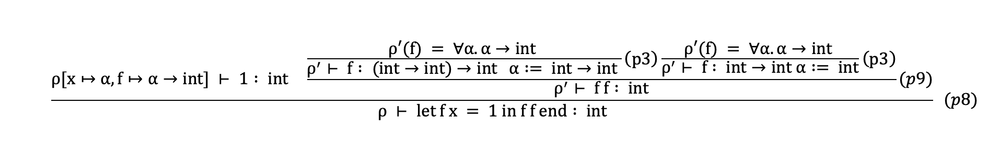
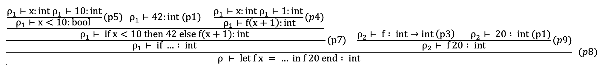

### Exercise 6.4

Type tree 6.4




### Exercise 6.5

#### (1)

- `let f x = 1 in f f end` : `int`. `f` is let-bound, so it is polymorphic.
- `let f g = g g in f end` : circularity error. `g` is a parameter, so it is not polymorphic, and `g g` would need `'a = 'a -> 'b`.
- `let f x = let g y = y in g false end in f 42 end` : `bool`
- `let f x = let g y = if true then y else x in g false end in f 42 end` : type error (bool and int). `g false` forces `x : bool`, so `f 42` fails.
- `let f x = let g y = if true then y else x in g false end in f true end` : `bool`

#### (2)

- `bool -> bool`: `let f x = if x then false else true in f end`
- `int -> int`: `let f x = x + 1 in f end`
- `int -> int -> int`: `let f x = let g y = x + y in g end in f end`
- `'a -> 'b -> 'a`: `let f x = let g y = x in g end in f end`
- `'a -> 'b -> 'b`: `let f x = let g y = y in g end in f end`
- `('a -> 'b) -> ('b -> 'c) -> ('a -> 'c)`: `let f g = let h k = let c x = k (g x) in c end in h end in f end`
- `'a -> 'b`: `let f x = f x in f end`
- `'a`: `let f x = f x in f 1 end`

### Exercise 7.1

We have build the compiler, run the fromfile and run the interpreter from the readme, The resulting tree from ex1.c with comments to indicate parts:

```fsharp
Prog                                                   // declaration: the whole program (program)
  [Fundec                                              // declaration: function declaration (topdec)
     (None,                                            // type: return type, None = void
      "main",                                          //   function name
      [(TypI, "n")],                                   // type: parameter n of type int
      Block                                            // statement: function body
        [Stmt                                          //   stmtordec: a statement (not a Dec)
           (While                                      // statement: while loop
              (Prim2 (">",                             // expression: condition  n > 0
                      Access (AccVar "n"),             // expression: read variable n
                      CstI 0),                         // expression: constant 0
               Block                                   // statement: loop body
                 [Stmt                                 //   stmtordec
                    (Expr                              // statement: expression statement  print n;
                       (Prim1 ("printi",               // expression: print an int
                               Access (AccVar "n"))));  // expression: read variable n
                  Stmt                                 //   stmtordec
                    (Expr                              // statement: expression statement  n = n - 1;
                       (Assign                         // expression: assignment
                          (AccVar "n",                 // access: the variable n (left-hand side)
                           Prim2 ("-",                 // expression: n - 1
                                  Access (AccVar "n"), // expression: read variable n
                                  CstI 1))))]));       // expression: constant 1
         Stmt                                          //   stmtordec
           (Expr                                       // statement: expression statement  println;
              (Prim1 ("println", CstI 10)))])]         // expression: print char 10 (newline)
```

### Exercise 7.2

We have written the programs included in the folder. There is no errors if freq is to small, it just gives a wrong answer.

### Exercise 7.3

We have changed the while loops to for loops, and extended CLex and CPar to handle the for loops.
